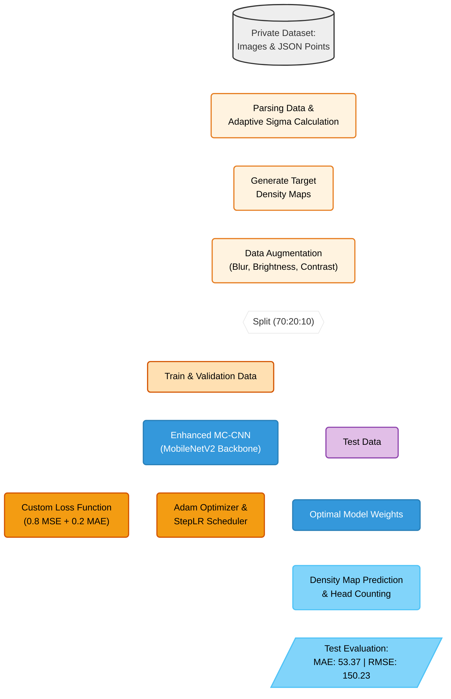
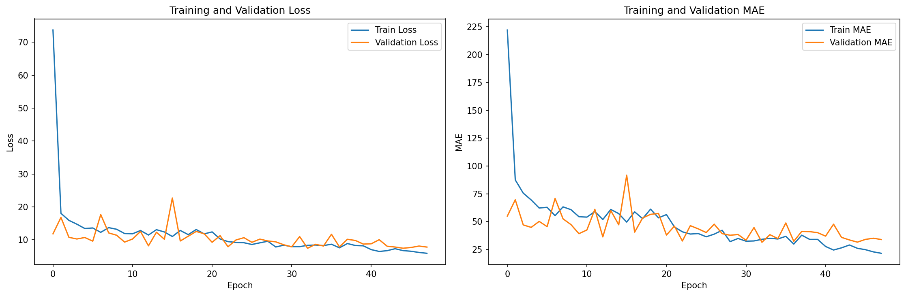
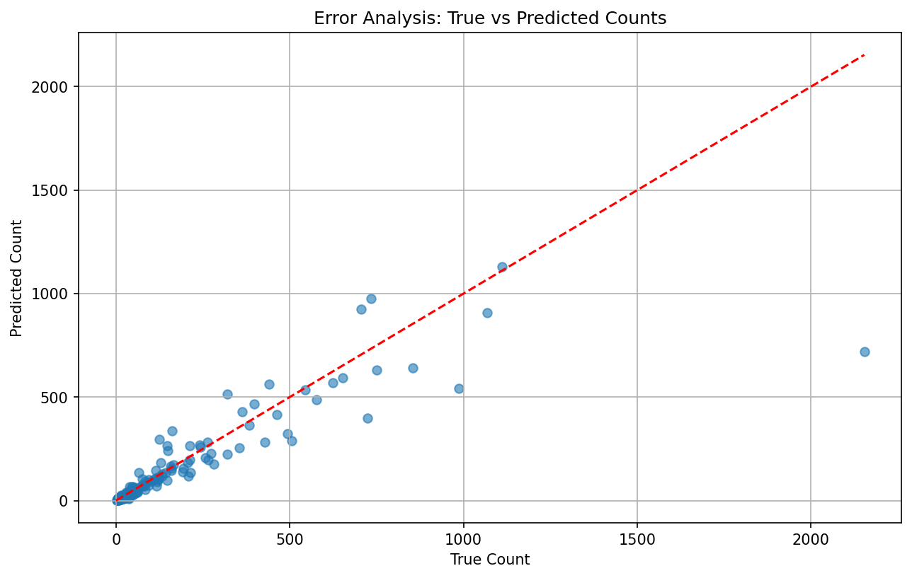
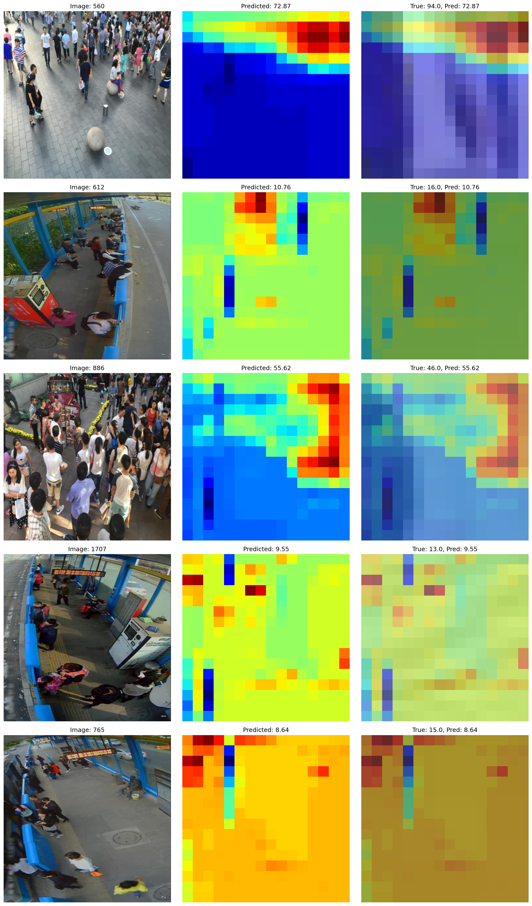

# Crowd Counting with Enhanced MC-CNN

---


Proyek ini merupakan pengembangan model *Computer Vision* untuk memprediksi jumlah kerumunan orang (Crowd Counting) dalam sebuah gambar berbasis estimasi peta kepadatan (*density map*). 

Pendekatan *density map* digunakan karena lebih tangguh dalam menangani kasus oklusi (objek saling menutupi) dan variasi skala kepala manusia dalam kerumunan dibandingkan dengan model deteksi objek tradisional (seperti YOLO atau SSD).

---

## Metodologi & Arsitektur Pipeline



---

## **Rincian Teknis & Hal yang Perlu Diperhatikan**

Pendekatan dalam notebook ini mengimplementasikan teknik pengolahan gambar tingkat lanjut dan penyesuaian arsitektur model:

1. **Adaptive Sigma untuk Density Map:** 
   Pembuatan *ground truth density map* tidak menggunakan radius tetap. Sistem memanfaatkan algoritma `KDTree` untuk menghitung jarak antar-titik (*head points*) guna menghasilkan nilai `sigma` yang adaptif. Hal ini sangat efektif untuk kerumunan yang padat (perspektif jauh) vs renggang (perspektif dekat).
2. **Arsitektur Enhanced MC-CNN:** 
   Model tidak dibangun dari nol, melainkan menggunakan *backbone* `MobileNetV2` yang ringan dan cepat untuk ekstraksi fitur awal. Fitur ini kemudian diteruskan ke 3 kolom konvolusi paralel dengan *receptive field* yang berbeda (ukuran filter 7x7, 5x5, dan 3x3) agar model bisa mengenali kepala manusia dalam berbagai skala.
3. **Custom Loss Function:** 
   Menggunakan penggabungan bobot (lambda = 0.8). `MSELoss` digunakan untuk menghukum kesalahan secara piksel pada *density map*, sedangkan `L1Loss` digunakan untuk menghukum kesalahan pada total prediksi *head count*.
4. **Dynamic Collation:** 
   Memungkinkan *training* gambar dengan resolusi yang berbeda-beda di dalam satu iterasi dengan melakukan *padding* tensor secara otomatis sesuai ukuran maksimum gambar pada setiap *batch*.

---

## **Hasil Evaluasi Model**

### Training & Validation History
Model dilatih selama 100 epoch dengan mekanisme *early stopping* pada patience 15. Dari grafik di bawah, dapat dilihat bahwa *loss* dan *Mean Absolute Error (MAE)* pada *training* dan *validation set* menunjukkan penurunan yang stabil dan konvergen.




### Analisis Kesalahan (Error Analysis)
Grafik sebaran ini membandingkan prediksi jumlah orang (*Predicted Count*) dengan jumlah sebenarnya (*True Count*). Titik-titik biru yang berada di dekat garis merah putus-putus menunjukkan bahwa prediksi model cukup akurat, terutama untuk kerumunan dengan jumlah di bawah 500 orang. Namun, model cenderung melakukan *under-estimation* pada kerumunan yang sangat padat (>1000 orang).




### Contoh Prediksi Peta Kepadatan (Density Map)
Berikut adalah visualisasi hasil prediksi model pada *Test Set*. Kolom pertama adalah gambar asli, kolom kedua adalah prediksi *density map* dari model, dan kolom ketiga menampilkan *overlay* kepekatan prediksi (Predicted: xx.xx) terhadap jumlah sebenarnya (True: xx.xx). Area dengan warna lebih hangat (merah/oranye) menunjukkan tingkat konsentrasi kerumunan yang tinggi.




### Metrik Evaluasi Akhir
*   **Validation MAE:** 45.48
*   **Validation RMSE:** 108.74
*   **Test MAE:** 53.37
*   **Test RMSE:** 150.23

---
*Dibuat oleh Muhammad Abil Hasan*
```
